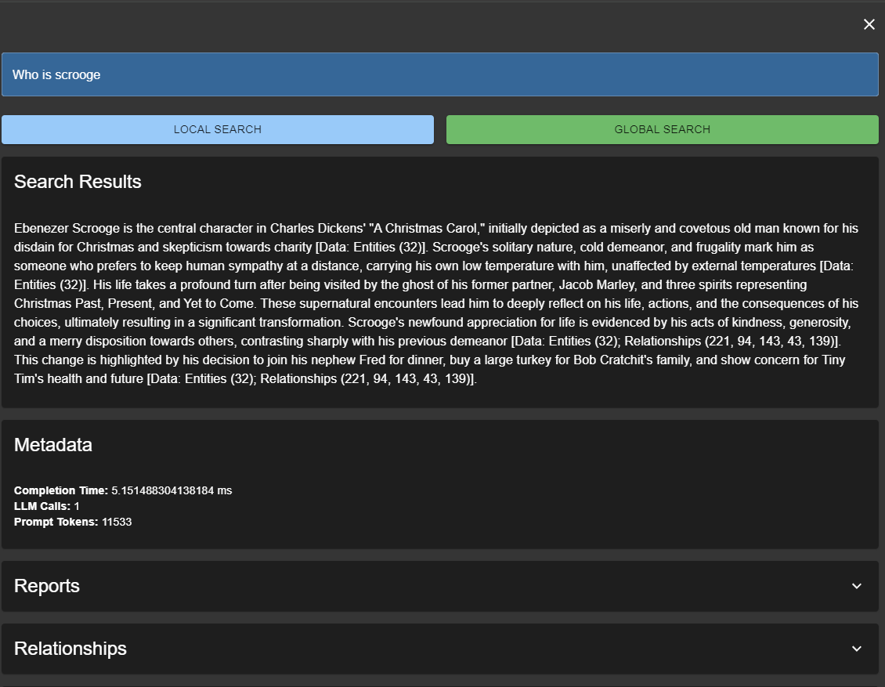

# GraphRAG API [](https://pypi.org/project/graphrag/2.2.0/)

A FastAPI-based server that provides Global, Local, DRIFT, and Basic search capabilities based on [Microsoft GraphRAG](https://github.com/microsoft/graphrag).
Designed for easy integration with the [GraphRAG Visualizer](https://noworneverev.github.io/graphrag-visualizer/) or custom clients.

## Installation

Clone the repository and install the required dependencies using the following commands:

```bash
git clone git@github.com:noworneverev/graphrag-api.git
cd graphrag-api
```

```bash
python -m venv venv
```

```bash
source venv/bin/activate # for Linux
venv\Scripts\activate # for Windows
```

```bash
pip install -r requirements.txt
```

## Usage

## Build and Install `graphrag` Locally Using Poetry (Windows)
Repo: [https://github.com/microsoft/graphrag](https://github.com/microsoft/graphrag)

## Step 1: Install Poetry

(Invoke-WebRequest -Uri https://install.python-poetry.org -UseBasicParsing).Content | python - 

## Step 2: Add Poetry to PATH (if needed)

$env:Path += ";$env:USERPROFILE\AppData\Roaming\Python\Scripts"

poetry --version

## Step 3: Go to the graphrag project directory

cd path\to\graphrag

poetry install

poetry build

## Running the api server
1. Copy the entire GraphRAG project directory (e.g., `ragtest/`) into the root of this repository. This folder must contain at least: `output`, `prompts`, `settings.yaml` and `.env`. COpy in both indexbox and in api.py directory. 
2. In `config.py`, point `PROJECT_DIRECTORY` at that folder, and adjust any other options as needed:
   ```python
   PROJECT_DIRECTORY = "indexbox"     # ← name of the folder you just copied
   COMMUNITY_LEVEL = 2
   CLAIM_EXTRACTION_ENABLED = False
   RESPONSE_TYPE = "Single Paragraph"
   ```
3. Run the API
   ```
   python api.py
   ```

Open http://127.0.0.1:8000/docs/ to see the API documentation.

You can also use the interface at [GraphRAG Visualizer](https://noworneverev.github.io/graphrag-visualizer/) to run queries against the server.



## API Endpoints

- `/search/global`: Perform a global search using GraphRAG.
- `/search/local`: Perform a local search using GraphRAG.
- `/search/drift`: Perform a DRIFT search using GraphRAG.
- `/search/basic`: Perform a basic search using text units.


pip install dist/graphrag-2.2.1-py3-none-any.whl

